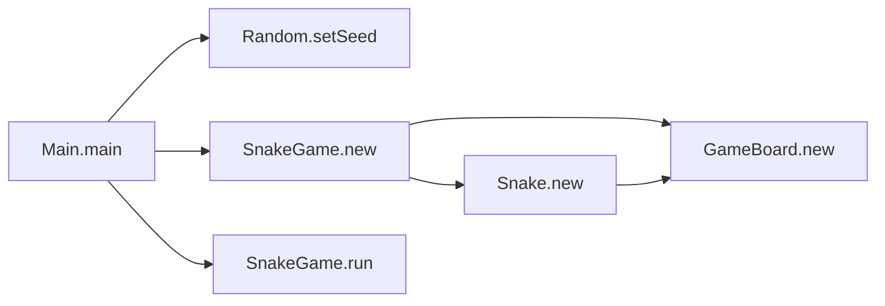

# SnakeGame

This repository contains a Snake game written in Jack for nand2tetris
Project 9.

The project is a complete interactive Jack application that runs on the Hack
platform through the nand2tetris VM toolchain.

## Course Context

This repository corresponds to:

- Project 9: High-Level Programming

Official project page:

- [Project 9](https://www.nand2tetris.org/project09)

Project 9 is about building an interactive application in Jack before moving on
to compiler construction in Projects 10 and 11. This repository uses that
project to implement a playable Snake game.

## What This Repository Contains

This repository contains:

- the Jack source code for the Snake game
- precompiled `.vm` files generated from that source

The game implements:

- a main game loop
- keyboard-controlled movement
- collision detection
- random food placement
- snake growth
- win and lose conditions

Important repository-specific details:

- `Main.jack` seeds the random generator with `12345`
- `debug` mode is currently set to `false`
- the target score is currently set to `5`
- the checked-in `.vm` files are build artifacts; the `.jack` files are the
  source of truth

## Repository Layout

```text
.
├── Main.jack
├── SnakeGame.jack
├── Snake.jack
├── GameBoard.jack
├── Random.jack
├── Main.vm
├── SnakeGame.vm
├── Snake.vm
├── GameBoard.vm
├── Random.vm
└── LICENSE
```

### Main Classes

- `Main.jack`
  Program entrypoint. Configures the game and starts execution.
- `SnakeGame.jack`
  Main controller: input loop, direction updates, movement, win/lose logic.
- `Snake.jack`
  Snake body storage, movement, rendering, and length growth.
- `GameBoard.jack`
  Board occupancy tracking, next-cell checks, and food placement.
- `Random.jack`
  Small pseudo-random generator used for food spawning.

### Compiled Artifacts

The `.vm` files are precompiled outputs. They can be regenerated from the Jack
source using a Jack compiler such as the sibling `JackCompiler` repository.

## How To Run

The official Project 9 workflow uses three tools:

- a text editor for the Jack source
- a Jack compiler
- the supplied nand2tetris VM Emulator

### Compile the Game

From the repository root:

```bash
python3 ../JackCompiler/jack_compiler.py .
```

This compiles all `.jack` files in the folder into the corresponding `.vm`
files.

### Run the Game in the nand2tetris VM Emulator

Following the official Project 9 instructions:

1. Open the supplied nand2tetris VM Emulator.
2. Load the `SnakeGame` folder into the emulator.
3. Run the program.

If the `.vm` files are already present and up to date, the game can be loaded
directly. Otherwise, compile the `.jack` files first.

### Which OS Version to Use

Project 9 supports two ways to run a Jack application:

- use the OS implementation built into the VM Emulator
- copy the compiled Jack OS `.vm` files into the application folder

According to the official Project 9 page, the VM Emulator checks whether a
called OS function exists in the loaded code base. If it does, that VM code is
used. Otherwise, the emulator falls back to the built-in OS implementation.

So for this project:

- using the built-in OS is enough to run the game
- using compiled OS `.vm` files is optional

## Controls

The game uses the following controls:

- `Up Arrow`: move up
- `Down Arrow`: move down
- `Left Arrow`: move left
- `Right Arrow`: move right
- `Q`: quit the game
- `X`: increase snake length manually when debug mode is enabled

Additional behavior:

- reverse-direction moves are blocked
- collision normally ends the game
- in debug mode, collisions print directional crash messages instead of ending
  the game immediately

## Game Rules

The game starts with a short snake near the top-left corner of the board.

Gameplay rules:

- the snake moves in the currently selected direction
- food is placed randomly on empty cells
- eating food increases the snake’s length
- each food pickup increments the score counter
- colliding with the snake body or the board boundary ends the game
- reaching the configured target score ends the run with a congratulatory
  message

The current default target score is `5`.

## Architecture

The program is split into a small set of focused Jack classes. `Main` creates a
`SnakeGame`, which owns the game board and snake state, and drives the main
input and update loop.



### 1. Startup Flow

`Main.main()` does the following:

1. seeds the random generator
2. sets `debug` mode
3. sets the target score
4. creates a `SnakeGame`
5. runs the game
6. disposes the game object

### 2. Main Game Loop

`SnakeGame.run()` is the central loop.

It:

- polls the keyboard
- updates direction on arrow-key presses
- advances the snake at a fixed interval
- checks for quit input
- detects game-over and game-finished conditions

Movement timing is controlled with:

- `Sys.wait(200)`

### 3. Snake Model

`Snake.jack` stores the snake body using two arrays:

- x coordinates
- y coordinates

The class is responsible for:

- shifting body segments
- moving the head
- drawing the snake
- erasing previous positions
- increasing length after food is eaten

### 4. Board Model

`GameBoard.jack` maintains a grid-based representation of the world.

Cell values are:

- `0`: empty
- `1`: snake body or blocked cell
- `2`: food

The board is responsible for:

- checking the next cell in each movement direction
- removing and re-adding snake cells as the snake moves
- placing food on empty cells

### 5. Random Food Placement

`Random.jack` provides a simple deterministic pseudo-random generator.

The game uses it to:

- choose random board rows
- choose random board columns
- retry until an empty cell is found

Because the seed is explicitly set in `Main.jack`, food placement is
deterministic across runs unless the seed is changed.

### 6. Rendering

Rendering is done using the Jack OS `Screen` class.

- snake segments are drawn as filled rectangles
- food is drawn as a filled cell
- text messages use the Jack OS `Output` class

## Class Overview

### `Main`

- sets the random seed
- configures debug mode and target score
- creates, runs, and disposes the game

### `SnakeGame`

- owns the board and snake objects
- tracks current direction
- tracks current food count and target score
- handles keyboard input and movement timing
- implements win and loss behavior

### `Snake`

- stores body coordinates
- moves in four directions
- shifts the body after each move
- grows after food is eaten
- draws and erases itself on the screen

### `GameBoard`

- computes board dimensions from cell size
- tracks occupied and food cells
- checks future movement collisions
- places new food items

### `Random`

- stores a mutable seed
- generates pseudo-random values
- provides bounded random integers for food placement

## Rendering and Board Geometry

The current game configuration uses:

- `boardCellSize = 15`

Board dimensions are derived from screen size in `GameBoard.jack`:

- rows are computed from `255 / cellSize`
- columns are computed from `511 / cellSize`

Rendering details:

- each snake segment is drawn slightly inset inside its board cell
- food is drawn as a filled rectangle covering the board cell
- the board itself is implicit; only snake and food are rendered

## Running and Testing Workflow

Project 9 testing is primarily manual and interactive.

### Compile and Run

The standard workflow is:

1. edit the `.jack` files
2. compile the project to `.vm`
3. load the folder into the supplied VM Emulator
4. run the program and test gameplay behavior

### Manual Testing Checklist

The most useful checks for this game are:

- the program starts without compiler or VM errors
- arrow keys move the snake correctly
- the snake cannot reverse into the opposite direction directly
- food appears on empty cells
- eating food increases the snake length
- collisions end the game
- pressing `Q` exits the game loop
- reaching the target score prints the success message

### Debug Mode

`Main.jack` exposes two easy knobs for development:

- `debug`
- `targetScore`

With `debug = true`:

- collisions print directional crash messages
- pressing `X` increases snake length manually

This makes it easier to test growth and collision logic without finishing a full
game run normally.

## Suggested Workflow

If you want to understand or modify the game, the most useful order is:

1. start with `Main.jack`
2. read `SnakeGame.jack`
3. read `Snake.jack`
4. read `GameBoard.jack`
5. finish with `Random.jack`

If you want to validate changes incrementally:

1. compile with the Jack compiler
2. run in the supplied VM Emulator
3. test movement first
4. then test food spawning and growth
5. finally test game-over and target-score completion flows

## References

- [Project 9](https://www.nand2tetris.org/project09)
